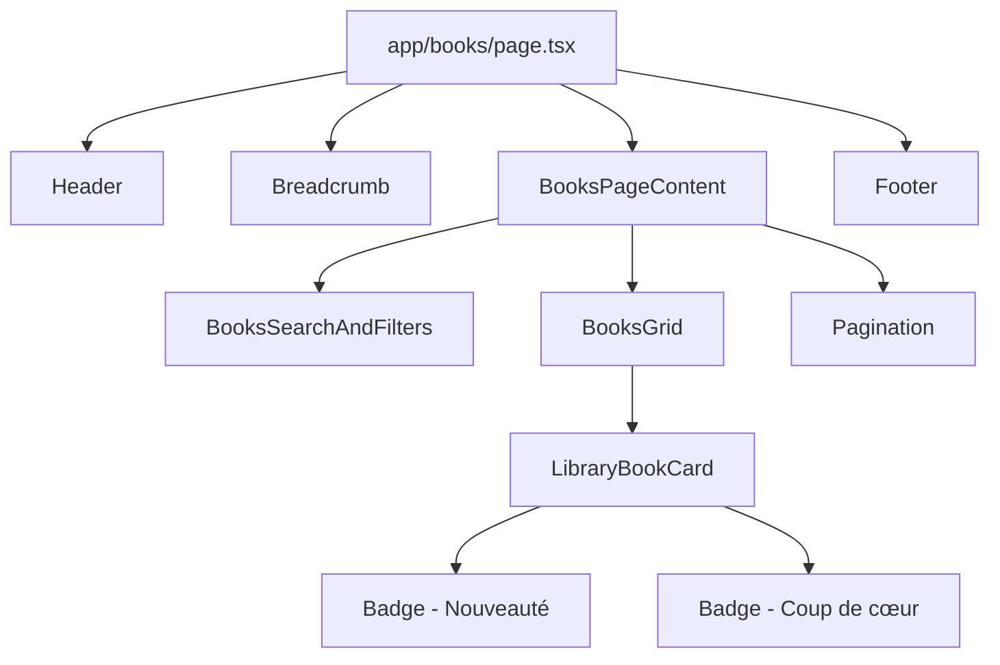

# Design Document: Books Library Page

## Overview

La page "Librairie" (Notre Librairie) est une page catalogue affichant tous les livres disponibles sur la plateforme Éditions Germinale. Elle reprend le style visuel du site (thème noir/or/blanc) tout en adaptant les cartes de livres au design spécifique montré dans l'image de référence (fond clair, catégories colorées).

Cette page est accessible via :
- Le lien "Librairie" dans la navigation principale
- Le bouton "Voir plus" à côté du titre "Livres populaires" sur la homepage

## Architecture



## Components and Interfaces

### 1. Page Component (Server Component)

**File:** `app/books/page.tsx`

```typescript
// Server Component - Page principale de la librairie
export default async function BooksPage() {
  // Récupère les livres depuis mockData (puis Prisma)
  const books = mockBooksExtended;
  
  return (
    <div className="min-h-screen flex flex-col bg-dark">
      <Header />
      <main className="flex-1">
        <div className="max-w-7xl mx-auto px-4 sm:px-6 lg:px-8 py-8">
          <Breadcrumb items={breadcrumbItems} />
          <h1>Tous nos Livres</h1>
          <p>Sous-titre descriptif</p>
          <BooksPageContent initialBooks={books} />
        </div>
      </main>
      <Footer />
    </div>
  );
}
```

### 2. BooksPageContent (Client Component)

**File:** `src/components/books/BooksPageContent.tsx`

```typescript
interface BooksPageContentProps {
  initialBooks: BookExtended[];
}

// Gère l'état de recherche, filtres et pagination
export function BooksPageContent({ initialBooks }: BooksPageContentProps) {
  const [searchValue, setSearchValue] = useState("");
  const [selectedGenre, setSelectedGenre] = useState("all");
  const [selectedAuthor, setSelectedAuthor] = useState("all");
  const [selectedPrice, setSelectedPrice] = useState("all");
  const [selectedSort, setSelectedSort] = useState("newest");
  const [currentPage, setCurrentPage] = useState(1);
  
  // Filtrage et pagination
  const filteredBooks = filterBooksBySearch(initialBooks, searchValue);
  const paginatedBooks = paginateBooks(filteredBooks, currentPage, BOOKS_PER_PAGE);
  
  return (
    <div>
      <BooksSearchAndFilters ... />
      <BooksGrid books={paginatedBooks} />
      <Pagination ... />
    </div>
  );
}
```

### 3. BooksSearchAndFilters Component

**File:** `src/components/books/BooksSearchAndFilters.tsx`

```typescript
interface BooksSearchAndFiltersProps {
  searchValue: string;
  onSearchChange: (value: string) => void;
  selectedGenre: string;
  onGenreChange: (value: string) => void;
  selectedAuthor: string;
  onAuthorChange: (value: string) => void;
  selectedPrice: string;
  onPriceChange: (value: string) => void;
  selectedSort: string;
  onSortChange: (value: string) => void;
}

// Barre de recherche + filtres déroulants
export function BooksSearchAndFilters(props: BooksSearchAndFiltersProps) {
  return (
    <div className="flex flex-col md:flex-row gap-4 mb-8">
      {/* Search input avec icône */}
      <div className="relative flex-1">
        <Search className="absolute left-3 top-1/2 -translate-y-1/2" />
        <input placeholder="Titre, auteur, ISBN..." />
      </div>
      
      {/* Filtres */}
      <FilterDropdown label="Genre" />
      <FilterDropdown label="Auteur" />
      <FilterDropdown label="Prix" />
      <FilterDropdown label="Trier par" icon={<SortIcon />} />
    </div>
  );
}
```

### 4. LibraryBookCard Component

**File:** `src/components/books/LibraryBookCard.tsx`

Ce composant est différent du BookCard existant car il suit le design de l'image :
- Fond blanc/crème au lieu de noir
- Image en format paysage (4:3) au lieu de portrait
- Catégorie en couleur au-dessus du titre
- Layout différent avec "Voir le livre" à droite

```typescript
interface LibraryBookCardProps {
  book: BookExtended;
}

export function LibraryBookCard({ book }: LibraryBookCardProps) {
  return (
    <article className="bg-white rounded-xl shadow-sm overflow-hidden">
      {/* Image avec badges */}
      <div className="relative aspect-[4/3]">
        <Image src={book.coverImage} alt={book.title} fill />
        {book.isNew && <Badge variant="new">Nouveauté</Badge>}
        {book.isFeatured && <Badge variant="featured">Coup de cœur</Badge>}
      </div>
      
      {/* Contenu */}
      <div className="p-4">
        <span className="text-xs uppercase text-teal-600">{book.category}</span>
        <h3 className="font-serif text-dark">{book.title}</h3>
        <p className="text-gray-500">Par {book.author}</p>
        
        {/* Footer */}
        <div className="flex justify-between items-center mt-4">
          <span className="font-semibold">{formatPrice(book.price)}</span>
          <Link href={`/books/${book.slug}`}>Voir le livre</Link>
        </div>
      </div>
    </article>
  );
}
```

### 5. PopularBooksSection Update

Ajouter le lien "Voir plus" à côté du titre :

```typescript
<div className="flex items-center justify-between mb-8">
  <h2 className="text-gold">Livres populaires</h2>
  <Link href="/books" className="text-gold hover:text-gold-light">
    Voir plus →
  </Link>
</div>
```

## Data Models

### BookExtended Interface

Extension de l'interface Book existante avec les champs supplémentaires :

```typescript
interface BookExtended extends Book {
  category: string;      // Catégorie du livre (LITTÉRATURE, POÉSIE, etc.)
  isNew?: boolean;       // Badge "Nouveauté"
  isFeatured?: boolean;  // Badge "Coup de cœur"
}
```

### Mock Data Extension

Ajouter dans `mockData.ts` :

```typescript
export const mockBooksExtended: BookExtended[] = [
  {
    id: "b1",
    title: "Mémoires d'un Scribe",
    slug: "memoires-scribe",
    author: "Jean-Paul Dubois",
    coverImage: "/images/placeholder-book.svg",
    price: 4500,
    category: "LITTÉRATURE",
    isNew: true,
  },
  // ... autres livres
];
```

## Correctness Properties

*A property is a characteristic or behavior that should hold true across all valid executions of a system—essentially, a formal statement about what the system should do. Properties serve as the bridge between human-readable specifications and machine-verifiable correctness guarantees.*

### Property 1: Search Filter Consistency

*For any* search query entered by a user, *all* books displayed in the results SHALL have a title or author name that contains the search query (case-insensitive).

**Validates: Requirements 2.7**

### Property 2: Filter Reset Pagination

*For any* filter change (search, genre, author, price, sort), the pagination SHALL reset to page 1.

**Validates: Requirements 2.8**

### Property 3: Books Per Page Limit

*For any* page of results, the number of books displayed SHALL be at most 6 (BOOKS_PER_PAGE constant).

**Validates: Requirements 3.4**

### Property 4: Book Card Data Formatting

*For any* book displayed in a LibraryBookCard:
- The author display SHALL follow the format "Par [author name]"
- The price SHALL be formatted in FCFA format using formatPrice()

**Validates: Requirements 4.4, 4.5**

### Property 5: Badge Display Consistency

*For any* book with `isNew: true`, the "Nouveauté" badge SHALL be displayed.
*For any* book with `isFeatured: true`, the "Coup de cœur" badge SHALL be displayed.

**Validates: Requirements 4.8, 4.9**

### Property 6: Pagination Navigation Consistency

*For any* pagination action:
- Clicking page N SHALL display books from index (N-1)*6 to N*6-1
- Clicking "next" SHALL increment the current page by 1
- Clicking "previous" SHALL decrement the current page by 1

**Validates: Requirements 5.4, 5.5, 5.6**

## Error Handling

### Empty State
- When no books match the search criteria, display a friendly message
- Suggest modifying the search or filters

### Image Loading Errors
- Use placeholder image if book cover fails to load
- Maintain aspect ratio even with placeholder

### Invalid Page Numbers
- Clamp page number to valid range [1, totalPages]
- Redirect to page 1 if requested page exceeds total

## Testing Strategy

### Unit Tests
- Test filterBooksBySearch function with various queries
- Test paginateBooks function with different page numbers
- Test formatPrice function for FCFA formatting
- Test LibraryBookCard renders all required elements
- Test badge display based on isNew/isFeatured flags

### Property-Based Tests (using fast-check)
- **Property 1**: Generate random search queries and verify all results contain the query
- **Property 2**: Generate random filter changes and verify page resets to 1
- **Property 3**: Generate random book lists and verify pagination limits
- **Property 4**: Generate random books and verify formatting
- **Property 5**: Generate random books with isNew/isFeatured and verify badges
- **Property 6**: Generate random page clicks and verify correct books displayed

### Integration Tests
- Test full page renders with Header, Content, Footer
- Test navigation from PopularBooksSection "Voir plus" link
- Test search + filter + pagination flow

### Configuration
- Minimum 100 iterations per property test
- Use fast-check library for property-based testing
- Tag format: **Feature: books-library-page, Property N: [property text]**
